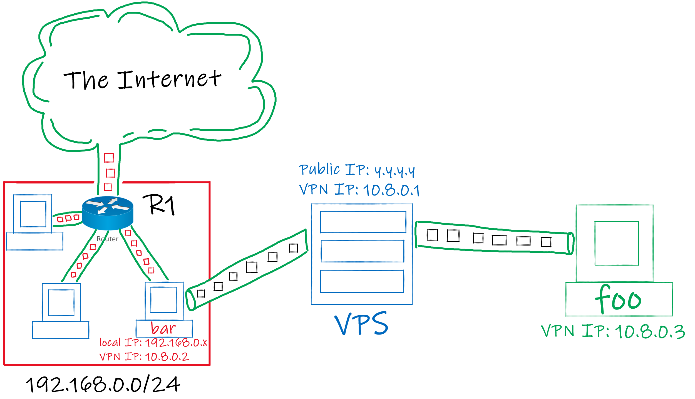

# Point to Site topology (WireGuard)
A point to Site topology connects a machine (let's call it `foo`) to a network using VPN.

To achieve this, in most cases you can make this connection between `foo` and a local machine `bar` on the desired network directly (with the help of `port forwarding`) but in some cases this network can be behind a Carrier-Grade NAT `CG-NAT`, this repo is here to help you in this situation.

We will use a VPS to run a VPN Server that is publicly accessible, then we can connect to that server from `foo` and `bar` and with some tweaks we can make `foo` not only communicate with `bar` but also with `bar`'s local area network.



## VPS configuration
* first, install `WireGuard` from the package manager.

    Ubuntu / Debian :
    ```
    sudo apt install wireguard
    ```
    Arch :
    ```
    sudo pacman -S wireguard-tools
    ```

    if you've chosen a different distro you can always seek guidence from WireGuard's [website](https://www.wireguard.com/install/ "https://www.wireguard.com/install/").

* then, generate public and private keys using this command:
    ```
    wg genkey | tee privatekey | wg pubkey > publickey
    ```
    you will have those keys generated in the current folder (directory).
* Use `middle_server/wg1.conf` file as a template and copy it to `/etc/wireguard` (may require root privileges).

* **Allow port `51820` udp on the firewall to accept connections from anywhere.**

## foo configuration
* Install `WireGuard` on your machine.
* Generate public and private keys using the same command (if you are using windows don't use `cmd` , use `powershell` instead to generate the keys).
* Use `foo/wg1.conf` file as a template and copy it to `/etc/wireguard` (if you are using windows import the config file into the WireGuard application).

## bar configuration
* Do exactly the same as before (on `foo` configuration).
* If `bar` is not the default gateway of its network then add a static route to the gateway (`R1` in the figure) to forward `10.8.0.0/24` packets to `bar`.

## Connection
After configuring the machines you can now establish a connection using this command:
```
sudo wg-quick up wg1
```
(if you are using windows press the `Activate` button on the WireGuard application).

If everything is configured properly you can now access any service running on `bar`'s network from `foo`.

If you're having any issues connecting to the VPN server even though you're sure everything is configured properly then one of the reasons is that your country is probably applying Deep Packet Inspection `DPI` which gives them the power to distinguish WireGuard traffic and drop it.

## REF
* DPI: https://en.wikipedia.org/wiki/Deep_packet_inspection
* CG-NAT: https://www.sidn.nl/en/news-and-blogs/cgnat-frustrates-all-ip-address-based-technologies
* WireGuard: https://www.wireguard.com/
* Point to Site topolgy (Routing): https://www.procustodibus.com/blog/2021/04/wireguard-point-to-site-routing/
* Point to Site topology (Masquerading): https://www.procustodibus.com/blog/2020/11/wireguard-point-to-site-config/
* Point to Site topology (Port Forwarding): https://www.procustodibus.com/blog/2021/04/wireguard-point-to-site-port-forwarding/
* Point to Site topology (Site Gateway): https://www.procustodibus.com/blog/2021/04/wireguard-point-to-site-gateway/
